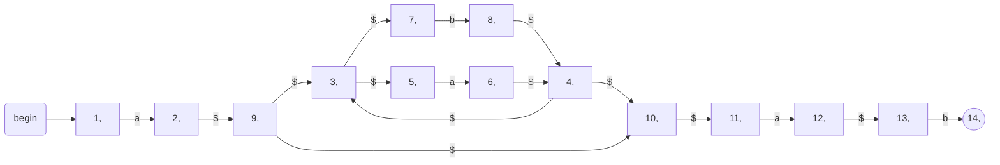
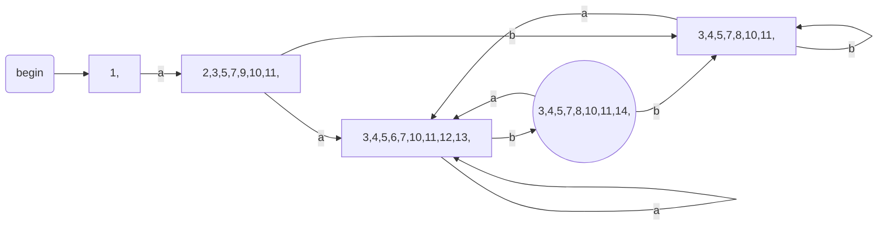
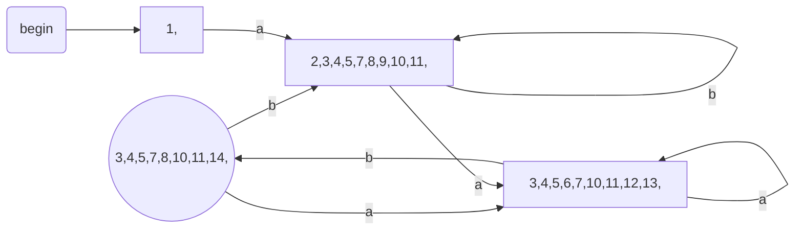

# NFA

```mermaid
graph LR
0(begin)-->1
4[4,]--$-->3[3,]
13[13,]--b-->14((14,))
12[12,]--$-->13[13,]
11[11,]--a-->12[12,]
10[10,]--$-->11[11,]
4[4,]--$-->10[10,]
8[8,]--$-->4[4,]
7[7,]--b-->8[8,]
3[3,]--$-->7[7,]
6[6,]--$-->4[4,]
5[5,]--a-->6[6,]
3[3,]--$-->5[5,]
9[9,]--$-->3[3,]
9[9,]--$-->10[10,]
2[2,]--$-->9[9,]
1[1,]--a-->2[2,]

```
# DFA

```mermaid
graph LR
14(begin)-->0
2[3,4,5,6,7,10,11,12,13,]--a-->2[3,4,5,6,7,10,11,12,13,]
4((3,4,5,7,8,10,11,14,))--a-->2[3,4,5,6,7,10,11,12,13,]
3[3,4,5,7,8,10,11,]--a-->2[3,4,5,6,7,10,11,12,13,]
3[3,4,5,7,8,10,11,]--b-->3[3,4,5,7,8,10,11,]
4((3,4,5,7,8,10,11,14,))--b-->3[3,4,5,7,8,10,11,]
2[3,4,5,6,7,10,11,12,13,]--b-->4((3,4,5,7,8,10,11,14,))
1[2,3,5,7,9,10,11,]--a-->2[3,4,5,6,7,10,11,12,13,]
1[2,3,5,7,9,10,11,]--b-->3[3,4,5,7,8,10,11,]
0[1,]--a-->1[2,3,5,7,9,10,11,]

```
# Minimized DFA

```mermaid
graph LR
0((3,4,5,7,8,10,11,14,))--a-->3[3,4,5,6,7,10,11,12,13,]
0((3,4,5,7,8,10,11,14,))--b-->2[2,3,4,5,7,8,9,10,11,]
1[1,]--a-->2[2,3,4,5,7,8,9,10,11,]
2[2,3,4,5,7,8,9,10,11,]--a-->3[3,4,5,6,7,10,11,12,13,]
2[2,3,4,5,7,8,9,10,11,]--b-->2[2,3,4,5,7,8,9,10,11,]
3[3,4,5,6,7,10,11,12,13,]--a-->3[3,4,5,6,7,10,11,12,13,]
3[3,4,5,6,7,10,11,12,13,]--b-->0((3,4,5,7,8,10,11,14,))
14(begin)-->1

```
