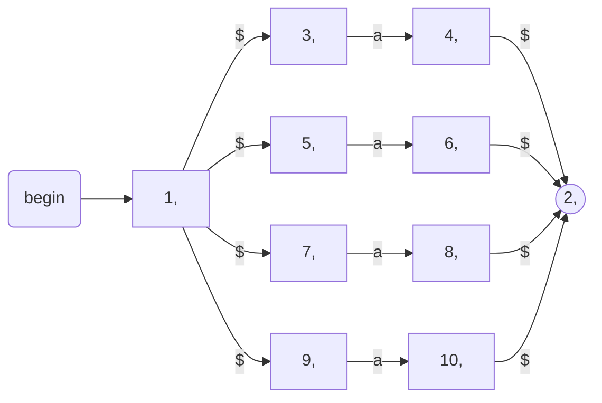
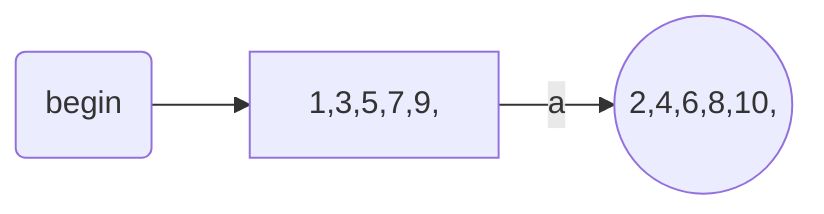

# NFA

```mermaid
graph LR
0(begin)-->1
4[4,]--$-->2((2,))
3[3,]--a-->4[4,]
1[1,]--$-->3[3,]
6[6,]--$-->2((2,))
5[5,]--a-->6[6,]
1[1,]--$-->5[5,]
8[8,]--$-->2((2,))
7[7,]--a-->8[8,]
1[1,]--$-->7[7,]
10[10,]--$-->2((2,))
9[9,]--a-->10[10,]
1[1,]--$-->9[9,]

```
# DFA

```mermaid
graph LR
10(begin)-->0
0[1,3,5,7,9,]--a-->1((2,4,6,8,10,))

```
# Minimized DFA

```mermaid
graph LR
1[1,3,5,7,9,]--a-->0((2,4,6,8,10,))
10(begin)-->1

```
