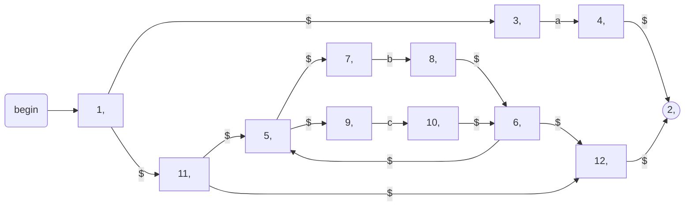
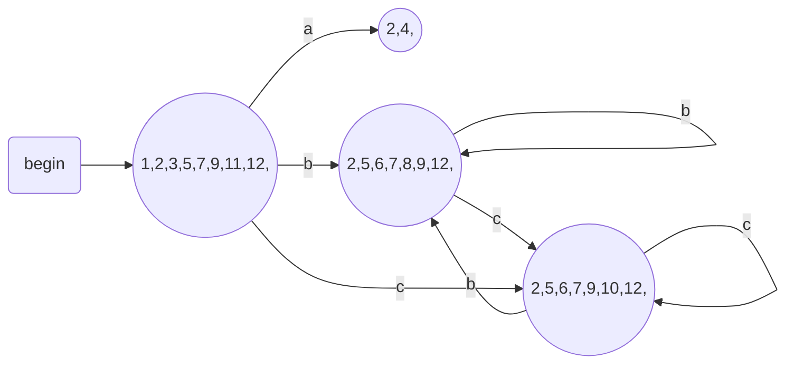
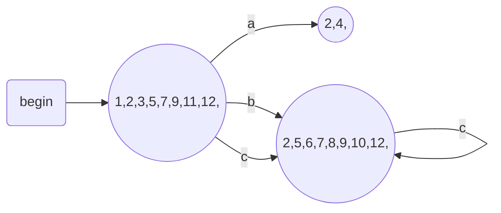

# NFA

```mermaid
graph LR
0(begin)-->1
4[4,]--$-->2((2,))
3[3,]--a-->4[4,]
1[1,]--$-->3[3,]
6[6,]--$-->5[5,]
12[12,]--$-->2((2,))
6[6,]--$-->12[12,]
8[8,]--$-->6[6,]
7[7,]--b-->8[8,]
5[5,]--$-->7[7,]
10[10,]--$-->6[6,]
9[9,]--c-->10[10,]
5[5,]--$-->9[9,]
11[11,]--$-->5[5,]
11[11,]--$-->12[12,]
1[1,]--$-->11[11,]

```
# DFA

```mermaid
graph LR
12(begin)-->0
0((1,2,3,5,7,9,11,12,))--a-->1((2,4,))
2((2,5,6,7,8,9,12,))--b-->2((2,5,6,7,8,9,12,))
3((2,5,6,7,9,10,12,))--b-->2((2,5,6,7,8,9,12,))
3((2,5,6,7,9,10,12,))--c-->3((2,5,6,7,9,10,12,))
2((2,5,6,7,8,9,12,))--c-->3((2,5,6,7,9,10,12,))
0((1,2,3,5,7,9,11,12,))--b-->2((2,5,6,7,8,9,12,))
0((1,2,3,5,7,9,11,12,))--c-->3((2,5,6,7,9,10,12,))

```
# Minimized DFA

```mermaid
graph LR
0((1,2,3,5,7,9,11,12,))--a-->1((2,4,))
0((1,2,3,5,7,9,11,12,))--b-->2((2,5,6,7,8,9,10,12,))
0((1,2,3,5,7,9,11,12,))--c-->2((2,5,6,7,8,9,10,12,))
2((2,5,6,7,8,9,10,12,))--b-->2((2,5,6,7,8,9,10,12,))
2((2,5,6,7,8,9,10,12,))--c-->2((2,5,6,7,8,9,10,12,))
12(begin)-->0

```
