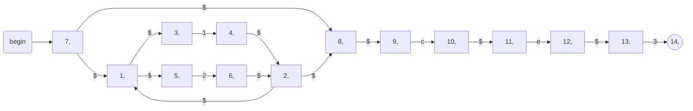
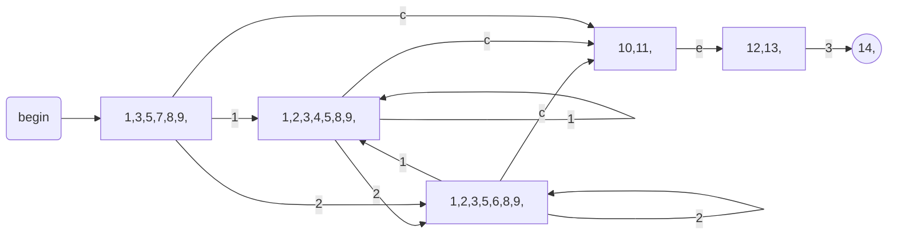
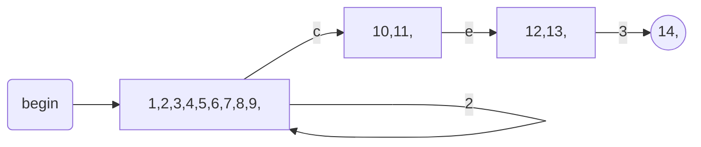

# NFA

```mermaid
graph LR
0(begin)-->7
13[13,]--3-->14((14,))
12[12,]--$-->13[13,]
11[11,]--e-->12[12,]
10[10,]--$-->11[11,]
9[9,]--c-->10[10,]
8[8,]--$-->9[9,]
7[7,]--$-->8[8,]
2[2,]--$-->8[8,]
2[2,]--$-->1[1,]
4[4,]--$-->2[2,]
3[3,]--1-->4[4,]
1[1,]--$-->3[3,]
6[6,]--$-->2[2,]
5[5,]--2-->6[6,]
1[1,]--$-->5[5,]
7[7,]--$-->1[1,]

```
# DFA

```mermaid
graph LR
14(begin)-->0
1[1,2,3,4,5,8,9,]--1-->1[1,2,3,4,5,8,9,]
2[1,2,3,5,6,8,9,]--1-->1[1,2,3,4,5,8,9,]
2[1,2,3,5,6,8,9,]--2-->2[1,2,3,5,6,8,9,]
4[12,13,]--3-->5((14,))
3[10,11,]--e-->4[12,13,]
2[1,2,3,5,6,8,9,]--c-->3[10,11,]
1[1,2,3,4,5,8,9,]--2-->2[1,2,3,5,6,8,9,]
1[1,2,3,4,5,8,9,]--c-->3[10,11,]
0[1,3,5,7,8,9,]--1-->1[1,2,3,4,5,8,9,]
0[1,3,5,7,8,9,]--2-->2[1,2,3,5,6,8,9,]
0[1,3,5,7,8,9,]--c-->3[10,11,]

```
# Minimized DFA

```mermaid
graph LR
1[1,2,3,4,5,6,7,8,9,]--1-->1[1,2,3,4,5,6,7,8,9,]
1[1,2,3,4,5,6,7,8,9,]--2-->1[1,2,3,4,5,6,7,8,9,]
1[1,2,3,4,5,6,7,8,9,]--c-->2[10,11,]
2[10,11,]--e-->3[12,13,]
3[12,13,]--3-->0((14,))
14(begin)-->1

```
